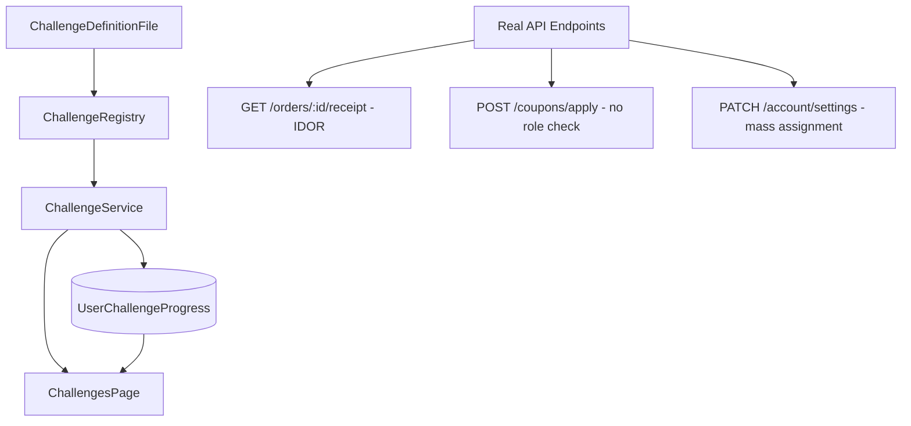
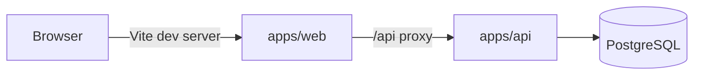

# Architecture

## Applications

- `apps/web`: the primary ShopLab frontend built with Vite, React, TypeScript, Tailwind, and shadcn/ui.
- `apps/api`: the Express API for auth, products, orders, cart, coupons, account settings, and the challenge registry.
- `database`: the PostgreSQL schema and per-user challenge progress storage.

## Challenge Architecture

Challenges are solved by attacking the real app directly (browser devtools, curl, Postman). The Challenges page only tracks progress, shows hints, and accepts flag submissions. There is no helper "lab" UI — the surface of the attack is the normal app.

## Runtime Flow

## Notes

- The web app is the canonical UI.
- The API owns challenge logic, auth, and challenge metadata delivery.
- Challenge definitions live in version-controlled files under `apps/api/src/challenges/`.
- The database stores user progress, not challenge metadata. Progress survives restarts because it is persisted in `user_challenge_progress`.
- The only way to mark a challenge solved is to submit the correct flag via `POST /api/challenges/solve`.
- Storefront product IDs in `apps/web/src/data/mockData.ts` are kept in sync with the DB seed via `productService.ensureSeed()` on startup, so orders, reviews, and cart checkouts resolve real product rows.
